# Special Note: Recognizing Juneteenth at CVPR 2022

This year, June 19 and 20 marks Juneteenth, a US holiday commemorating the end of slavery in the US, and a holiday of special significance in the US South. We encourage attendees to learn more about Juneteenth and its historical context, and to join the city of New Orleans in celebrating the Juneteenth holiday.
 
You can find out more information about Juneteenth here: <a href="https://cvpr2022.thecvf.com/recognizing-juneteenth">https://cvpr2022.thecvf.com/recognizing-juneteenth</a>

# Updates
- <strong>Jun 06, 2022:</strong> Challenge winners announced! Check **[challenge page](./challenge.html)** for more details.
- <strong>Mar 10, 2022:</strong> Challenge leaderboard now live <a href="https://codalab.lisn.upsaclay.fr/competitions/2618">HERE</a>.
- <strong>Mar 08, 2022:</strong> Evaluation dataset released (check **[challenge page](./challenge.html)** for more details).
- <strong>Mar 08, 2022:</strong> Dates updated for workshop and challenge.

# Overview

Most of the real-world data is sequential and there is always a distribution shift when we move from training set to real-world testing scenario. This workshop invites researchers from both academia and industry to advance the research in robust learning for real-world applications. The goal of this workshop is to explore the fundamental problems in the characterization of distribution shifts in sequential data and to develop robust models for sequential data for real-world applications.

# Invited Speakers
**Talk 1: Open world recognition and distribution shifts in videos**

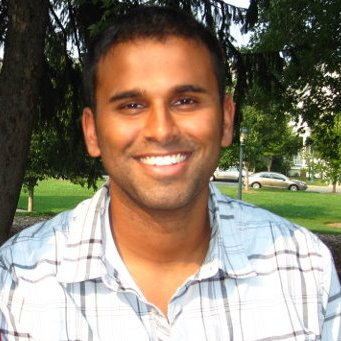

<a href="http://www.cs.cmu.edu/~deva/">Deva Ramanan</a> is a professor in the Robotics Institute at Carnegie- Mellon University and the director of the CMU Argo AI Center for Autonomous Vehicle Research. His research interests span computer vision and machine learning, with a focus on visual recognition. He was awarded the David Marr Prize in 2009, the PASCAL VOC Lifetime Achievement Prize in 2010, the IEEE PAMI Young Researcher Award in 2012, named one of Popular Science’s Brilliant 10 researchers in 2012, named a National Academy of Sciences Kavli Fellow in 2013, won the Longuet-Higgins Prize in 2018 for fundamental contributions in computer vision, and was recognized for best paper awards in CVPR 2019, ECCV 2020, and ICCV 2021. He served as the program chair of the IEEE Computer Vision and Pattern Recognition (CVPR) 2018.

**Talk 2: Predictive models and their link to robustness**

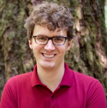

<a href="https://datascience.columbia.edu/people/carl-vondrick/">Carl Vondrick</a> is an assistant professor of computer science at Columbia University. His research focuses on computer vision and machine learning. His research is supported by the NSF, DARPA, Amazon, and Toyota, and his work has appeared on the national news, such as CNN, NPR, the Associated Press, Stephen Colbert’s television show, as well as some children’s magazines. He received the 2021 NSF CAREER Award, the 2021 Toyota Young Faculty Award, and the 2018 Amazon Research Award. Previously, he was a Research Scientist at Google and he received his PhD from MIT in 2017.

**Talk 3: Robust multimodal learning**

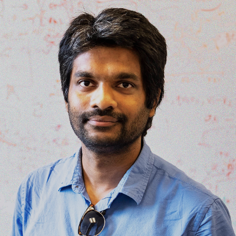

<a href="https://www.cs.unc.edu/~mbansal/">Mohit Bansal</a> is the John R. Louise S. Parker Associate Professor and the Director of the MURGe-Lab (UNC-NLP Group) in the CS department at UNC Chapel Hill. He received his PhD from UC Berkeley in 2013. His research expertise is in multimodal, grounded, and embodied NLP, human-like language generation and QA/dialogue, and interpretable and generalizable deep learning. He is a recipient of the 2020 IJCAI Early CAREER Spotlight, 2019 DARPA Director’s fellowship, 2019 Google Focused Research Award, 2019 Microsoft Investigator Fellowship, and 2019 NSF CAREER Award. He has organized several workshops at the primary NLP and vision conferences.

**Talk 4: Robustness in continual learning**

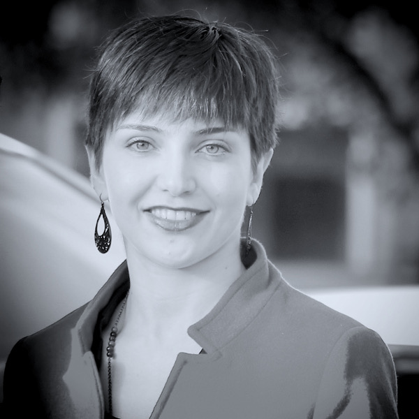

<a href="https://saynaebrahimi.github.io/">Sayna Ebrahimi</a> is a research scientist at Google. Previously she was a postdoctoral scholar at UC Berkeley working with Trevor Darrell. She also received her PhD from UC Berkeley where she double majored in Computer Science and Mechanical Engineering advised by Trevor Darrell in EECS and David Steigmann in the ME department. Her research lies at the intersection of computer vision and machine learning with specialization in continual learning, active learning, and test-time adaptation. She has spent time as a research intern at Facebook AI Research and NVIDIA. She has been awarded the NASA-EPSCoR fellowship and UC Berkeley Otto and Herta F. Kornei Endowment fellowship. She has also co-organized the Workshop on Continual Learning at ICML 2020 and Women in Computer Vision workshop at CVPR 2019.

**Talk 5: Building neural networks that know what they don’t know**

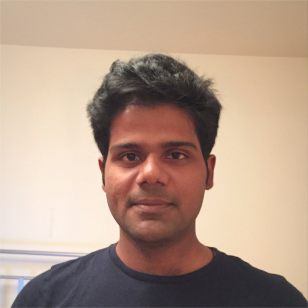

<a href="http://www.gatsby.ucl.ac.uk/~balaji/">Balaji Lakshminarayanan</a> is a staff research scientist at Google Brain. His recent research is focused on probabilistic deep learning, specifically, uncertainty estimation, out-of-distribution robustness and applications. Before joining Google Brain, he was a research scientist at DeepMind. He received his PhD from the Gatsby Unit, University College London where he worked with Yee Whye Teh. He has co-organized several workshops on "Uncertainty and Robustness in deep learning" and served as Area Chair for NeurIPS, ICML, ICLR and AISTATS.
 <b>Abstract:</b> Deep neural networks can make overconfident errors and assign high confidence predictions to inputs far away from the training data. Well-calibrated predictive uncertainty estimates are important to know when to trust a model's predictions, especially for safe deployment of models in applications where the train and test distributions can be different. I'll first present some concrete examples that motivate the need for uncertainty and out-of-distribution (OOD) robustness in deep learning. Next, I'll present an overview of our recent work focused on building neural networks that know what they don’t know: this includes methods which improve single model uncertainty (e.g. <a href="https://arxiv.org/abs/2006.10108">spectral-normalized neural Gaussian processes</a>), methods which average over multiple neural network predictions such as Bayesian neural nets and <a href="https://arxiv.org/abs/1612.01474">deep ensembles</a>, and methods that leverage better representations (e.g. <a href="https://arxiv.org/abs/2106.03004">improving “near-OOD” detection</a>).

**Talk 6: Developing interpretable model with multi-modal data**

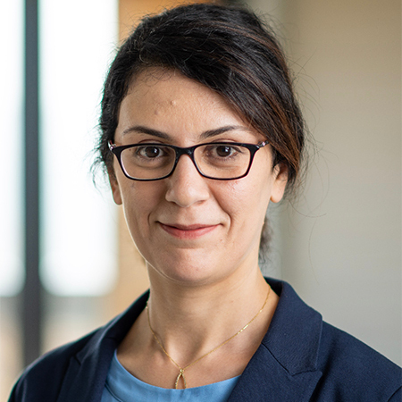

<a href="https://homes.cs.washington.edu/~hannaneh/">Hannaneh Hajishirzi</a> is an Associate Professor in the Paul G. Allen School of Computer Science & Engineering at the University of Washington and a Senior Research Manager at the Allen Institute for AI. Her research spans different areas in NLP and AI, focusing on developing general-purpose machine learning algorithms that can solve diverse NLP tasks. Applications for these algorithms include question answering, representation learning, green AI, knowledge extraction, and conversational dialogue. Honors include the NSF CAREER Award, Sloan Fellowship, Allen Distinguished Investigator Award, Intel rising star award, best paper and honorable mention awards, and several industry research faculty awards. Hanna received her PhD from University of Illinois and spent a year as a postdoc at Disney Research and CMU.

**Talk 7: Algorithms for robust lifelong learning**

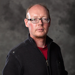

<a href="http://ilab.usc.edu/itti/">Laurent Itti</a> is a professor of computer science and psychology at the University of Southern California, Viterbi School of Engineering. He received the M.S. degree in image processing from the Ecole Nationale Superieure des Telecommunications, France, in 1994, and the Ph.D. degree in computation and neural systems from Caltech, CA, USA, in 2000. His research interests are in biologically-inspired computational vision, in particular in the domains of visual attention, scene understanding, control of eye movements, and surprise, with technological applications to, among others, video compression, target detection, and robotics. He has coauthored more than 150 publications in peer-reviewed journals, books and conferences, three patents, and several open-source neuromorphic vision software toolkits.

## Call for papers
We invite interested researchers to submit relevant work related to robust learning for real-world applications at **[https://cmt3.research.microsoft.com/ROSE2022](https://cmt3.research.microsoft.com/ROSE2022)**. Please refer to the **[call for papers](./call-for-papers.html)** page for more details.

## Important workshop dates
- Workshop announcement: <strong>Jan 01, 2022</strong>
- Workshop paper submission deadline: <strong><s>March 10, 2022</s> March 28, 2022</strong>
- Notification to authors: <strong><s>April 01, 2022</s> April 12, 2022</strong>
- Camera ready deadline: <strong><s>April 08, 2022</s> April 18, 2022</strong>

## Challenge details

We will host a challenge on robust activity recognition in videos in conjunction with this workshop.
This challenge invites participants from both academia and industry to develop robust activity
recognition models which will be tested for robustness against various perturbations.

Please refer to the **[challenge page](./challenge.html)** for more details.

The challenge deadlines are as follows:
- Challenge announcement: <strong>Jan 10, 2022</strong>
- Release of testing data: <strong><s>Feb 10, 2022</s> March 08, 2022</strong>
- Leaderboard open: <strong><s>Feb 25, 2022</s> March 10, 2022</strong>
- Challenge submission deadline [paper track]: <strong><s>March 10, 2022</s> March 28, 2022</strong>
- Challenge submission deadline: <strong>May 31, 2022</strong>
- Winner announcement: <strong>June 05, 2022</strong>

## Schedule

| Time | Event | Duration |
| ----- | ----- | ----- |
08:30 AM-08:45 AM  |  Opening  |  (15 min)
08:45 AM-09:30 AM  |  Invited Talk 1: Deva Ramanan  |  (45 min)
09:30 AM-10:15 AM  |  Invited Talk 2: Carl Vondrick    |  (45 min)
10:15 AM-10:45 AM  |  Coffee Break  |  (30 min)
10:45 AM-11:30 AM  |  Invited Talk 3: Mohit Bansal  |  (45 min)
11:30 AM-12:15 AM  |  Invited Talk 4: Sayna Ebrahimi  |  (45 min)
12:15 AM-12:30 PM  |  Paper Presentation  |  (15 min)
12:30 PM-01:30 PM  |  Lunch Break  |  (60 min)
12:30 PM-03:00 PM  |  Poster presentation (parallel event) | 
01:30 PM-02:15 PM  |  Invited Talk 5: Balaji Lakshminarayanan  |  (45 min)
02:15 PM-03:00 PM  |  Invited Talk 6: Hannaneh Hajishirzi  |  (45 min)
03:00 PM-03:45 PM  |  Invited Talk 7: Laurent Itti  |  (45min)
03:45 PM-04:15 PM  |  Coffee Break  |  (30 min)
04:15 PM-04:25 PM  |  Challenge introduction  |  (10 min)
04:25 PM-05:45 PM  |  Challenge presentations  |  (20 min)
04:45 PM-05:00 PM  |  Closing Remarks  |  (15 min)

## Organizers

  

    <a href="http://vibhavvineet.info">
    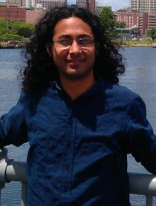
    </a> 
    <a href="http://vibhavvineet.info">Vibhav Vineet</a> 
    Microsoft Research
  

  
  

  

   
  

    <a href="https://www.crcv.ucf.edu/person/rawat/">
    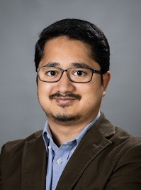
    </a> 
  <a href="https://www.crcv.ucf.edu/person/rawat/">Yogesh Rawat</a> 
    CRCV, University of Central Florida (UCF)
  

  
  

  

   
  

    <a href="https://www.microsoft.com/en-us/research/people/hpalangi">
    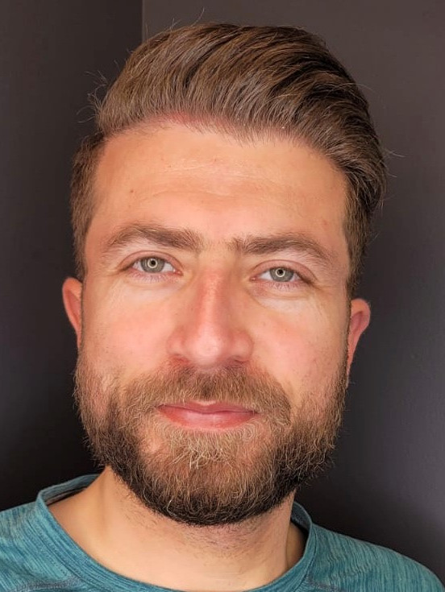
    </a> 
  <a href="https://www.microsoft.com/en-us/research/people/hpalangi">Hamid Palangi</a> 
    Microsoft Research
  

  
  

  

   
  

    <a href="https://www.crcv.ucf.edu/person/mubarak-shah">
    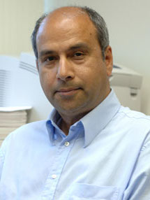
    </a> 
  <a href="https://www.crcv.ucf.edu/person/mubarak-shah">Mubarak Shah</a> 
    CRCV, University of Central Florida (UCF)
  

  

    <a href="https://xinw.ai/">
    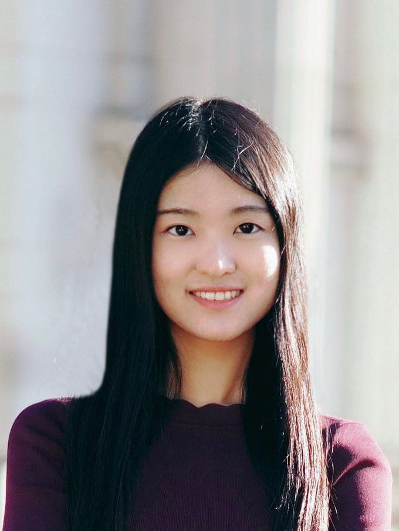
    </a> 
    <a href="https://xinw.ai/">Xin Wang</a> 
    Microsoft Research
  

  
  

  

  
  

    <a href="https://scholar.google.com/citations?user=15YqUQUAAAAJ&hl=en&oi=ao">
    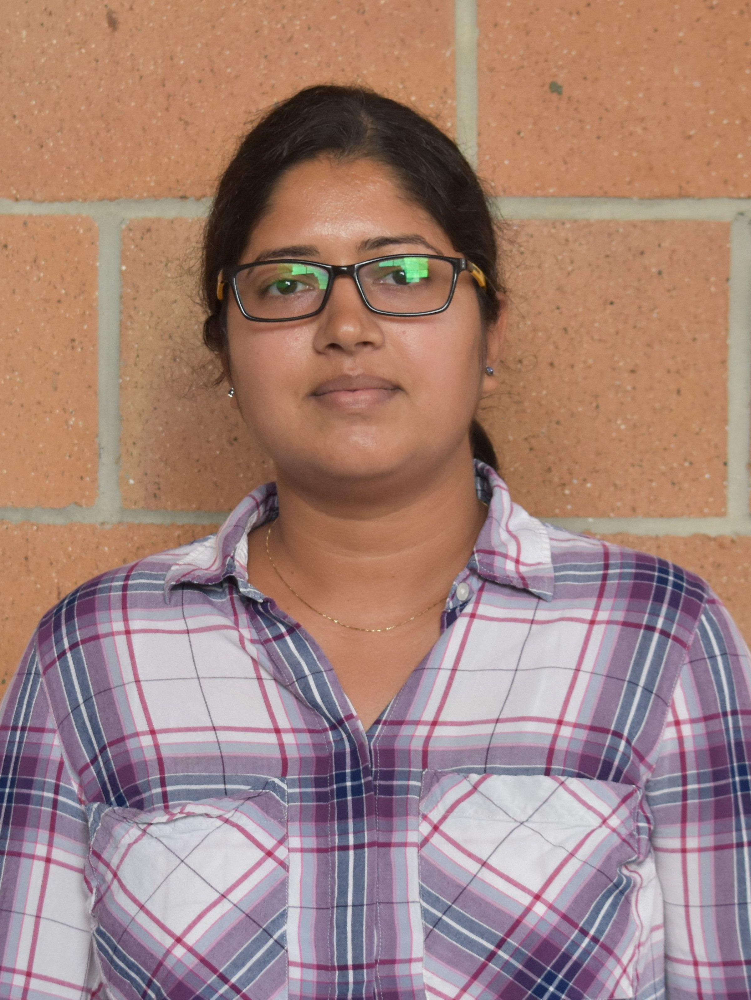
    </a> 
  <a href="https://scholar.google.com/citations?user=15YqUQUAAAAJ&hl=en&oi=ao">Shruti Vyas</a> 
    CRCV, University of Central Florida (UCF)
  

  

  

  
  

    <a href="https://saynaebrahimi.github.io">
    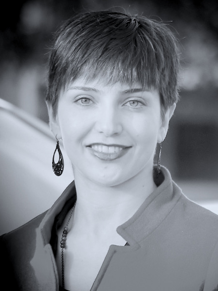
    </a> 
  <a href="https://saynaebrahimi.github.io">Sayna Ebrahimi</a> 
    Google Cloud AI
  

  
  

  

  
  

    <a href="https://www.cs.unc.edu/~mbansal">
    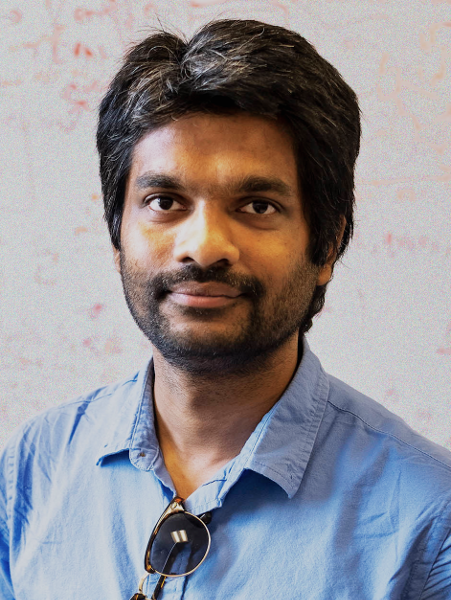
    </a> 
  <a href="https://www.cs.unc.edu/~mbansal">Mohit Bansal</a> 
    University of North Carolina (UNC) Chapel Hill
  

## Advising committee

  

    <a href="https://www.cs.ubc.ca/~murphyk/">
    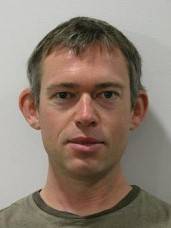
    </a> 
    <a href="https://www.cs.ubc.ca/~murphyk/">Kevin Murphy</a> 
    Google, USA
  

  
  

  

   
  

    <a href="https://homes.cs.washington.edu/~yejin/">
    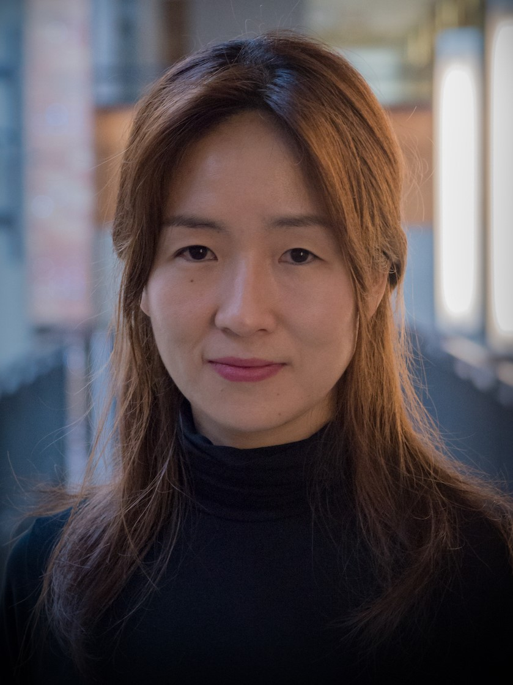
    </a> 
  <a href="https://homes.cs.washington.edu/~yejin/">Yejin Choi</a> 
    University of Washington, USA
  

## Program Committee

| --- | --- |
| Dr Kevin Duarte | ML Engineer, Adobe, USA |
| Chengzhi Mao | PhD Student, Columbia University, USA |
| Nayeem Mamshad Rizve | PhD Student, University of Central Florida, USA |
| Dr. Shu Kong | Postdoc, Carnegie Mellon University, USA |
| Dr. Navid Kardan | Postdoc, University of Central Florida, USA |
| Dr. Naveed Akhtar | Assistant Professor, University of Western Australia, Australia |
| Aayush Rana | PhD Student, University of Central Florida, USA |
| Rahul Ambati | PhD Student, University of Central Florida, USA |
| Dr. Rajiv Shah | Assistant Professor, Indraprastha Institute of Information Technology Delhi, India |
| Xu Ziwei | PhD Student, National University of Singapore, Singapore |
| Dr. Jack Hessel | Research Scientist, AI2, USA |
| Yunhao (Andy) Ge | PhD student, University of Southern California, USA |
| Isht Dwivedi | Research Engineer, Honda Research, USA |

## Student Organizers

| --- | --- |
| Aayush Rana | PhD Student, University of Central Florida, USA |
| Madeline Schiappa | PhD Student, University of Central Florida, USA |
| Naman Biyani | Undergrad Student, IIT Kanpur, India |

### Join our **[mailing list](https://groups.google.com/g/robustness-challenge)** for updates.
For any questions, please contact **Yogesh Rawat [yogesh@crcv.ucf.edu]** and  **Vibhav Vineet [Vibhav.Vineet@microsoft.com]**.

